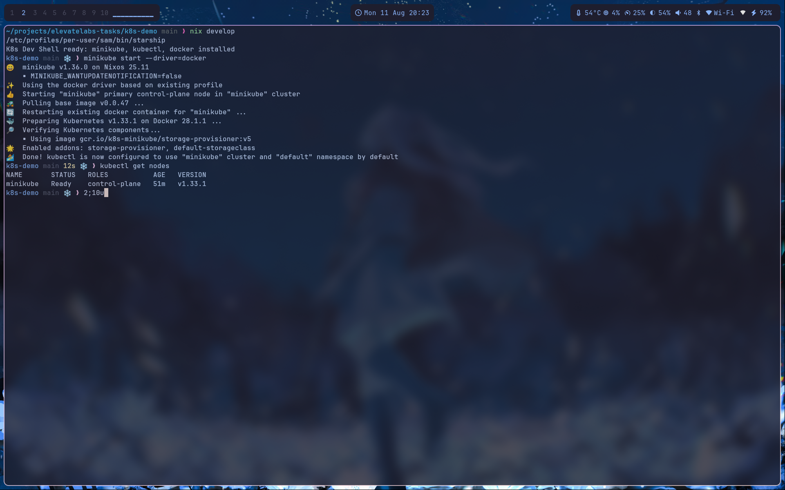
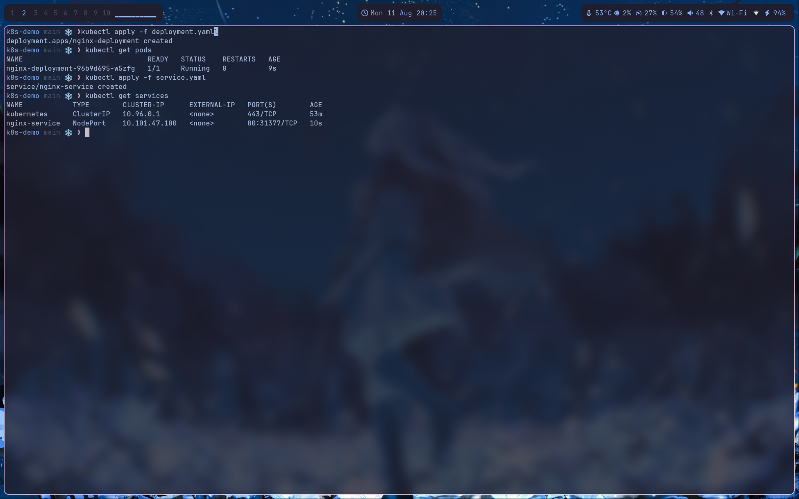
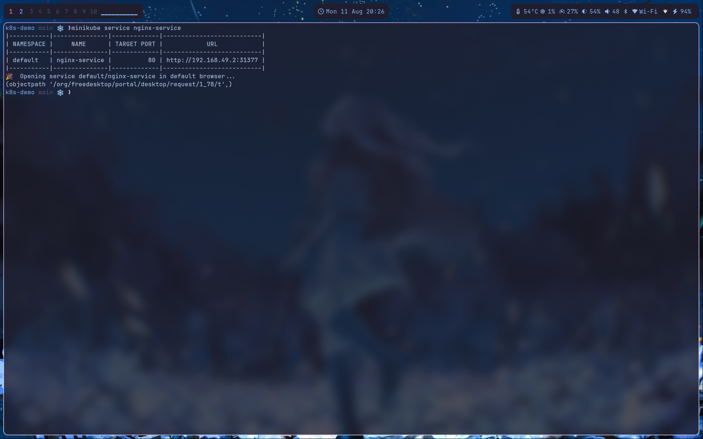
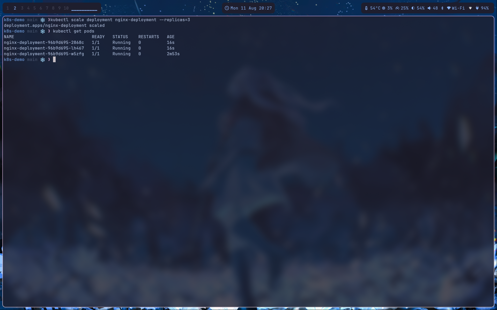
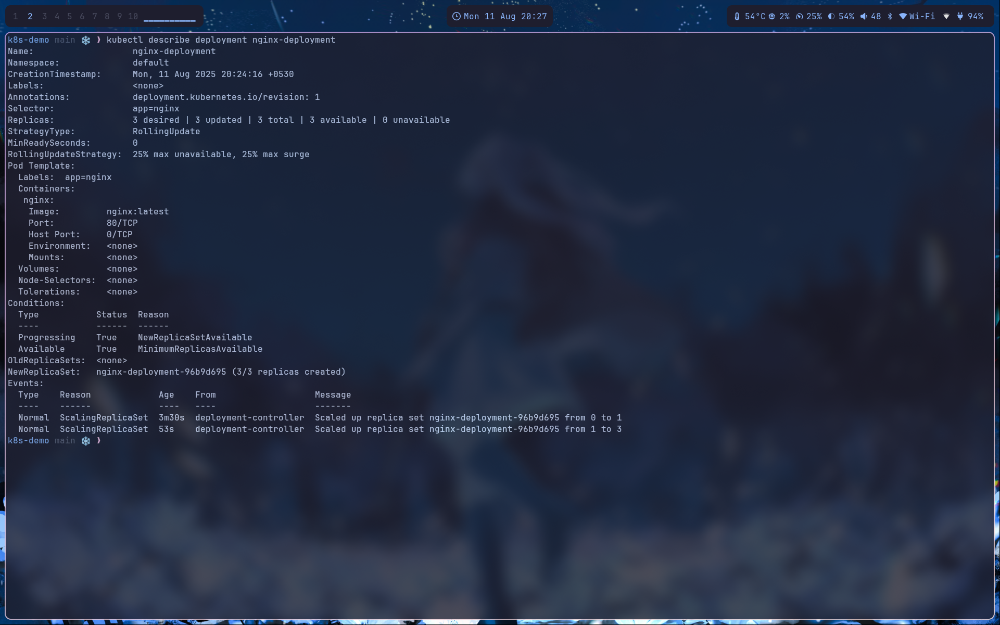
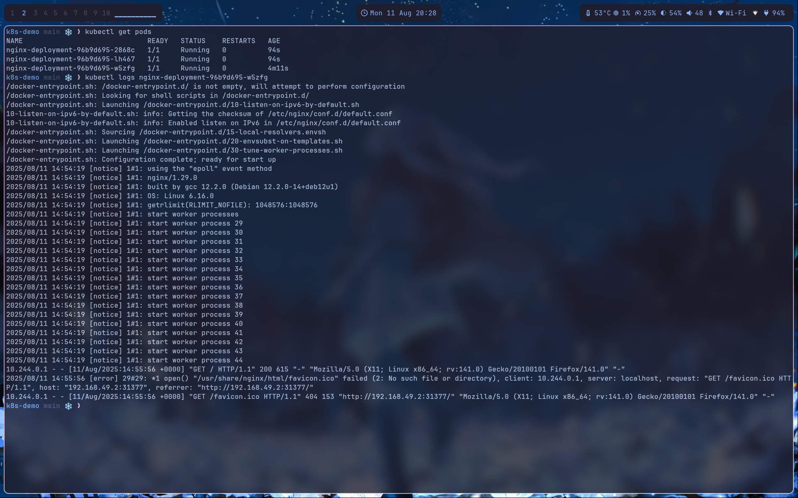

# k8s-demo

This repo demonstrates how to deploy and manage applications in Kubernetes using Minikube, kubectl, and Docker. It includes YAML configuration files for deploying an nginx application and exposing it as a service.

## Directory Structure

```
k8s-demo/
├── deployment.yaml     # Kubernetes deployment configuration for nginx
├── service.yaml        # Kubernetes service configuration to expose nginx
├── flake.nix          # Nix development environment with minikube, kubectl, docker
├── flake.lock         # Nix lock file for reproducible builds
└── README.md          # This file
```

## Prerequisites

- **Nix Package Manager** (recommended) OR individual installation of:
  - Docker
  - Minikube
  - kubectl

## Setup Instructions

### Option 1: Using Nix (Recommended)

If you have Nix with flakes enabled:

```bash
# Enter the development shell (installs minikube, kubectl, docker)
nix develop

# Start minikube cluster
minikube start

# Verify cluster is running
kubectl cluster-info
```

### Option 2: Manual Installation

1. **Install Docker**
   ```bash
   # Follow Docker installation guide for your OS
   # https://docs.docker.com/get-docker/
   ```

2. **Install Minikube**
   ```bash
   # Linux
   curl -LO https://storage.googleapis.com/minikube/releases/latest/minikube-linux-amd64
   sudo install minikube-linux-amd64 /usr/local/bin/minikube
   ```

3. **Install kubectl**
   ```bash
   # Linux
   curl -LO "https://dl.k8s.io/release/$(curl -L -s https://dl.k8s.io/release/stable.txt)/bin/linux/amd64/kubectl"
   sudo install -o root -g root -m 0755 kubectl /usr/local/bin/kubectl
   ```

4. **Start Minikube**
   ```bash
   minikube start
   ```

## Deployment Steps

### 1. Deploy the Application

Deploy the nginx application using the deployment configuration:

```bash
kubectl apply -f deployment.yaml
```

### 2. Expose the Application

Create a service to expose the nginx deployment:

```bash
kubectl apply -f service.yaml
```

### 3. Verify Deployment

Check that pods are running:

```bash
kubectl get pods
```

Check services:

```bash
kubectl get services
```

### 4. Access the Application

Get the service URL:

```bash
minikube service nginx-service --url
```

Or open in browser:

```bash
minikube service nginx-service
```

## Consolidated list of commands used

### Verification Commands

```bash
# Get all pods
kubectl get pods

# Get all services
kubectl get services

# Get detailed information about a pod
kubectl describe pod <pod-name>

# View pod logs
kubectl logs <pod-name>

# Get cluster information
kubectl cluster-info
```

### Scaling Commands

```bash
# Scale deployment to 3 replicas
kubectl scale deployment nginx-deployment --replicas=3

# Verify scaling
kubectl get pods
```

### Cleanup Commands

```bash
# Delete service
kubectl delete service nginx-service

# Delete deployment
kubectl delete deployment nginx-deployment

# Stop minikube
minikube stop

# Delete minikube cluster
minikube delete
```

## Configuration Files

### deployment.yaml
Defines a Kubernetes deployment for nginx with:
- 1 replica (can be scaled)
- nginx:latest image
- Container port 80
- App label: nginx

### service.yaml
Defines a Kubernetes service to expose nginx with:
- NodePort type for external access
- TCP protocol on port 80
- Targets pods with app: nginx label

## Screenshots

### Installing and starting minikube (here via the flake)


### Starting the deployment and service


### Accessing the running pod


### Scaling the deployment


### Describe pod & logs

